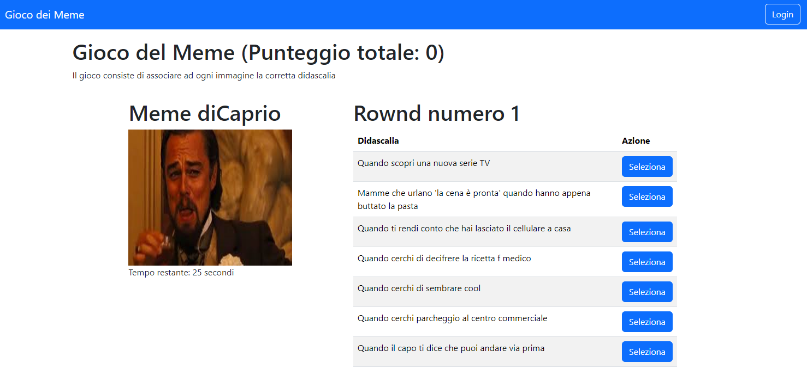
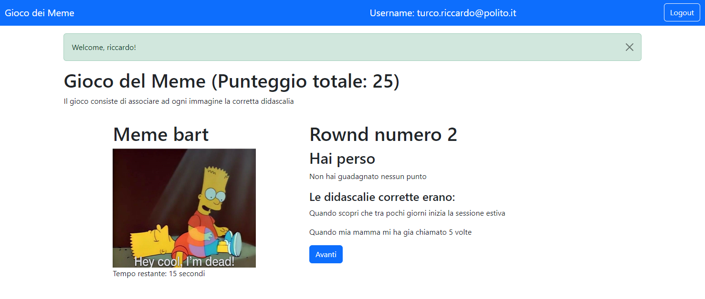

# Gioco dei Meme
## Turco Riccardo Daniele 

## React Client Application Routes

- Route `/`: pagina principale su cui verra renderizzato il gioco
- Route `/login`: pagina in cui sara presente il form per effettuare il login
- Route `/history/:username`: pagina in cui verra mostrata la history delle partite precendentemente giocate dall'utente, se l'utente non è loggato reindirizza alla index
- Route `*`: route che invia un mesaggio di errore per tutte le route non disponibili

## API Server

- GET `/api/meme/random`
  - request parameters: nessuno
  - response body content: restituisce un nuovo meme random {id, percorso}
- GET `/img/:percorso.png`
  - request parameters: Identificatore dell'immagine richiesta (percorso)
  - response body content: restituisce l'immagine in base al percorso
- GET `/api/meme/random/:username`
  - request parameters: Identificatore dell'utente che sta facendo la richiesta (username)
  - response body content: restituisce un nuovo meme random {id, percorso} diverso da quelli nella stessa partita
- GET `/api/meme/:memeId/random`
  - request parameters: Identificatore del meme (memeId)
  - response body content: restituisce 7 didascalie {id, testo}, 2 corrette per il memeId e 5 errate in ordine casuale 
- GET `/api/meme/:memeId/didascalia/:didascaliaId`
  - request parameters: Identificatore del meme (memeId) e identificatore della didascalia (didascaliaId) scelta per il meme
  - response body content: restituisce se si ha risposto correttamente o no e le due didascalie corrette {val, did1, did2}
- GET `/api/history/:username`
  - request parameters: Identificatore dell'utente che sta facendo la richiesta (username)
  - response body content: restituisce i risultati delle partite giocate dall'utente [{id, emailUser, meme1, didascalia1, risultato1, meme2, didascalia2, risultato2, meme3, didascalia3, risultato3}]
- POST `/api/result`
  - request parameters and request body content: salva il risultato della partita giocata dall'utente nel db [{username, meme1, didascalia1, risultato1, meme2, didascalia2, risultato2, meme3, didascalia3, risultato3}]
  - response body content: se la risciesta e andata a buon fine restituisce codice 201
- POST `/api/sessions`
  - request parameters and request body content: Effettua il login dell'utente parametri {username, password}
  - response body content: se la risciesta e andata a buon fine restituisce codice 201 e la sessione con i dati dell'utente {username, name, punteggio}
- GET `/api/sessions/current`
  - request parameters: Controlla che l'utente è autenticato, riceve la sessione
  - response body content: Se si restituisce la sessione con dentro i dati utente altrimenti un codice di errore 401
- DELETE `/api/sessions/current`
  - request parameters: riceve la sessione utente
  - response body content: Termina la sessione effettuando cosi il logout

## Database Tables

- Table `users` - Utilizata per memorizzare le informazioni degli utenti registrati. 
  - Contiene: email, name, punteggio, password, salt
- Table `meme` - Utilizata per memorizzare le informazioni sui meme. 
  - Contiene: id, percorso
- Table `didascalia` - Utilizata per memorizzare le didascalie possibili per i meme. 
  - Contiene: id, testo, memeId
- Table `risultati` - Utilizata per memorizzare lo storico delle partite per i vari utenti
  - Contiene: id, emailUser, meme1, didascalia1, risultato1, meme2, didascalia2, risultato2, meme3, didascalia3, risultato3

## Main React Components

- `NavHeader` (in `NavHeader.jsx`): componente che ha lo scopo di gestite la navbar
- `LogoutButton` (in `AuthComponents.jsx`): componente che ha lo scopo generare ib bottone di logout
- `LoginForm` (in `AuthComponents.jsx`): componente che genera il form per la login
- `GameLayout` (in `GameComponents.jsx`): componente in cui viene gestito il gioco
- `FormGame` (in `GameComponents.jsx`): componente che gestisce l'immagine del meme e le varie didascalie
- `TimerComponent` (in `GameComponents.jsx`): componente che gestisce il timer di gioco
- `DidascaliaRow` (in `GameComponents.jsx`): componente che genera ogni row nella tabella delle didascalie
- `HistoryTab` (in `GameHistory.jsx`): componente che genera la pagina per la visualizzazione delle partite gia' giocate dall'utente
- `TableRow` (in `GameHistory.jsx`): componente che genera le row della history table
- `NotFound` (in `NotFoundComponent.jsx`): componente che un messaggio di errore selle route errate

## Screenshot

## Users Credentials

- turco.riccardo@polito.it, testtest
- albert.einstein@relativity.org, testtest
